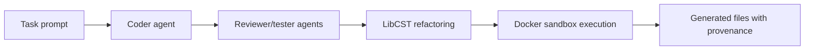

# Architecture

Experimental coding-swarm workflow using Gemini, LibCST refactoring, Docker sandbox execution, and provenance metadata for generated outputs.

This document is written for reviewers who want to understand how the project is shaped before reading the code. It emphasizes boundaries, dependencies, and degraded paths rather than marketing claims.

## Data Flow

1. Task prompt
2. Coder agent
3. Reviewer/tester agents
4. LibCST refactoring
5. Docker sandbox execution
6. Generated files with provenance

## Main Components

- **Agents**: Generate, review, and test code while labeling mock/fallback paths.
- **Sandbox**: Runs code/tests in Docker when configured and marks degraded execution paths.
- **Refactorer**: Uses LibCST for structured Python edits.
- **Swarm coordinator**: Propagates provenance metadata into generated files.

## External Dependencies

- Python 3.10+
- Optional Gemini API key
- Optional Docker
- LibCST

The project is intentionally explicit about optional services. Mock, fallback, and degraded paths are labeled in result metadata so a demo cannot be mistaken for a successful production integration.

## Failure And Degraded Modes

- External-service failures are captured as warnings, status fields, or source metadata where the domain model supports it.
- Mock/demo behavior is opt-in or explicitly labeled.
- Generated outputs are treated as review candidates, not authoritative decisions.
- CLI output remains user-facing; library internals use logging or structured metadata.

## What To Review In Code

- Generated code carries source/degraded metadata.
- Docker mock/failure paths are not confused with real sandbox execution.
- Tests demonstrate provenance propagation through the workflow.

## Current Limits

- Generated code must be reviewed and tested manually.
- Docker sandboxing is not a complete security boundary.
- Gemini or parser failures produce degraded outputs for inspection, not automatic trust.
